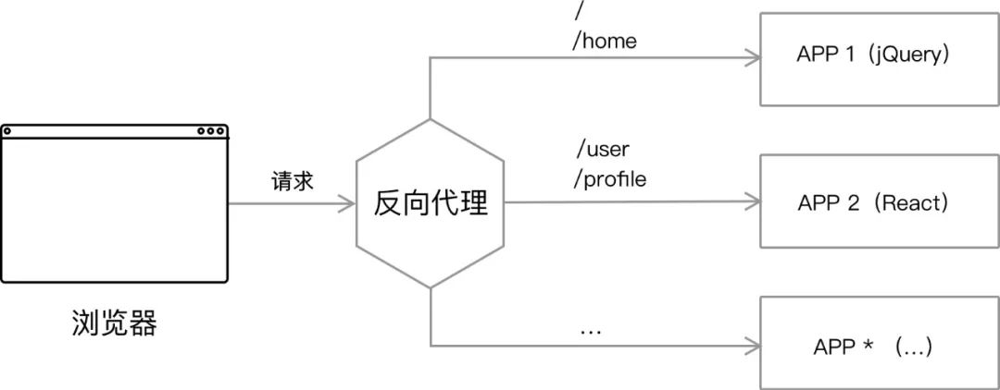
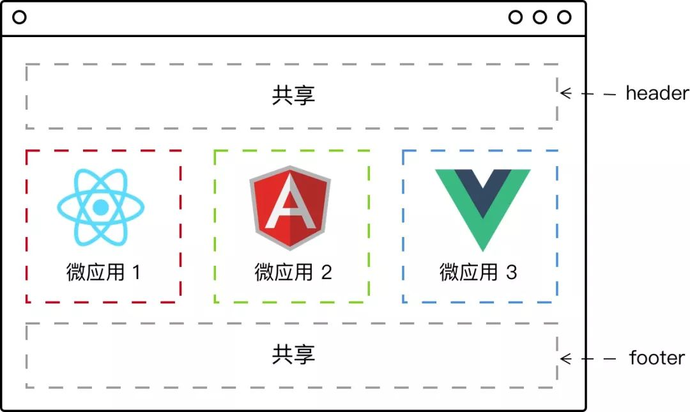
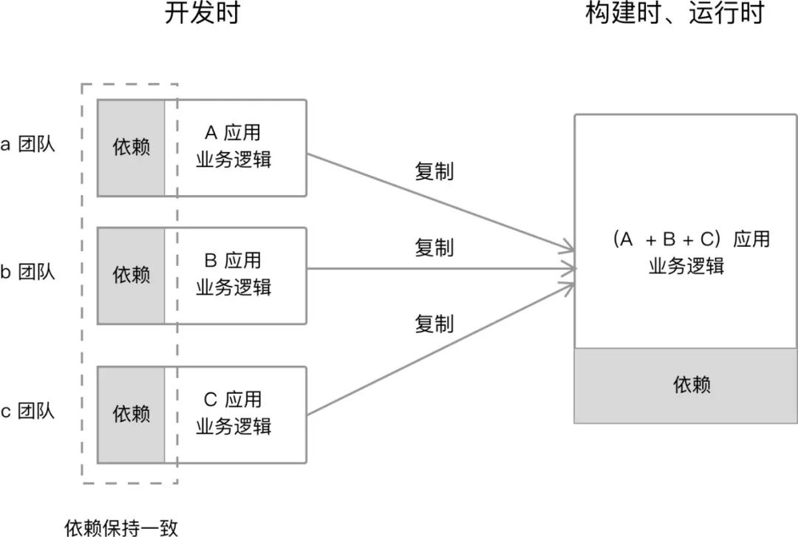
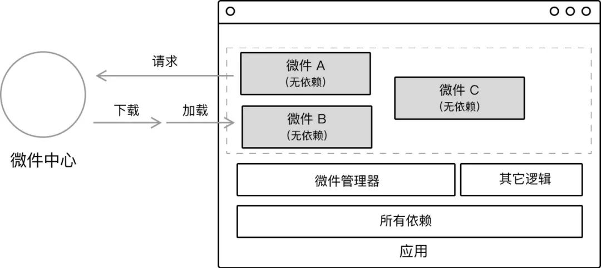
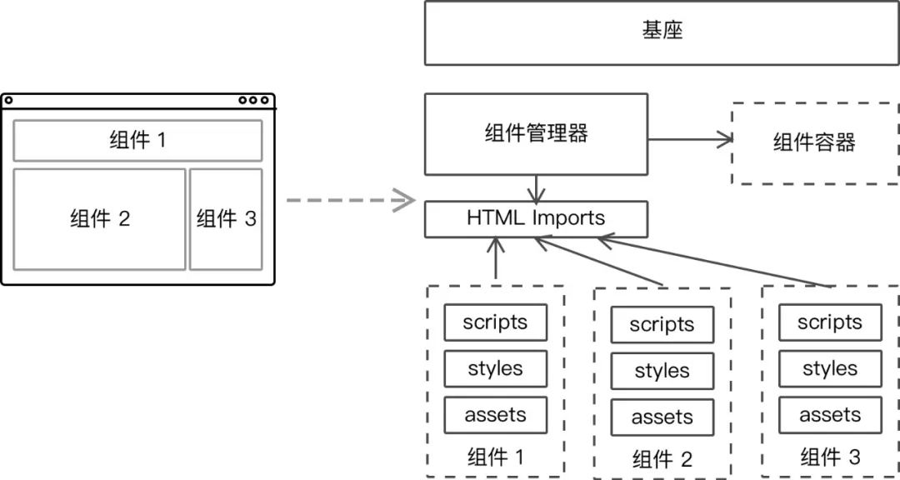

# 微前端笔记

::: tip
所谓架构，其实是解决人的问题；

所谓敏捷，其实是解决沟通的问题
:::

## 概念

**微前端**借鉴**微服务**的概念来应用在前端上，将一个巨大的前端工程拆分成一个的小工程，这些小工程具备独立的开发和运行能力，而整个系统就由这些小工程协同合作。

[微前端的核心价值](https://zhuanlan.zhihu.com/p/95085796)在于**技术栈无关**，这才是它诞生的理由，或者说这才是能说服我们采用微前端方案的理由。

为什么呢？

- 遗留系统迁移。解决遗留系统，才是人们采用微前端方案最重要的原因。

- 聚合前端应用。微服务架构，可以解耦后端服务间依赖。而微前端，则关注于聚合前端应用。

微前端的前提，还是得有主体应用，然后才有微组件或微应用，解决的是**可控体系下的前端协同开发问题**（含空间分离带来的协作和时间延续带来的升级维护）。

微前端的实现，意味着对前端应用的拆分。拆分应用的目的，并不只是为了架构上好看，还为了提升开发效率。

为此，微前端带来这么一系列的好处：

- 应用自治。只需要遵循统一的接口规范或者框架，以便于系统集成到一起，相互之间是不存在依赖关系的。

- 单一职责。每个前端应用可以只关注于自己所需要完成的功能。

- 技术栈无关。你可以使用 `Angular` 的同时，又可以使用 `React` 和 `Vue`。

除此，它也有一系列的缺点：

- 应用的拆分基础依赖于基础设施的构建，一旦大量应用依赖于同一基础设施，那么维护变成了一个挑战。

- 拆分的粒度越小，便意味着架构变得复杂、维护成本变高。

- 技术栈一旦多样化，便意味着技术栈混乱。

## 架构模式

微前端应用间的关系来看，分为两种：**基座模式**（管理式）、**自组织式**。分别也对应了两者不同的架构模式：

- 基座模式。通过一个主应用，来管理其它应用。设计难度小，方便实践，但是通用度低。

- 自组织模式。应用之间是平等的，不存在相互管理的模式。设计难度大，不方便实施，但是通用度高。

就当前而言，基座模式实施起来比较方便，方案上也是蛮多的。

而不论哪种方式，都需要提供一个查找应用的机制，在微前端中称为`服务的注册表模式`。

和微服务架构相似，不论是哪种微前端方式，也都需要有一个应用注册表的服务，它可以是一个固定值的配置文件，如` JSON `文件，又或者是一个可动态更新的配置，又或者是一种动态的服务。

它主要做这些内容：

- 应用发现。让主应用可以寻找到其它应用。

- 应用注册。即提供新的微前端应用，向应用注册表注册的功能。

- 第三方应用注册。即让第三方应用，可以接入到系统中。

- 访问权限等相关配置。

## 设计理念
在设计的过程中，需要关注的内容：

- 中心化：应用注册表。这个应用注册表拥有每个应用及对应的入口。在前端领域里，入口的直接表现形式可以是路由，又或者对应的应用映射。

- 标识化应用。我们需要一个标识符来标识不同的应用，以便于在安装、卸载的时候，能寻找到指定的应用。一个简单的模式，就是通过康威定律来命名应用。

- 应用生命周期管理。

- 高内聚，低耦合。

## 生命周期
前端微架构与后端微架构的最大不同之处，也在于此——**生命周期**。微前端应用作为一个客户端应用，每个应用都拥有自己的生命周期：

- Load，决定加载哪个应用，并绑定生命周期

- bootstrap，获取静态资源

- Mount，安装应用，如创建 DOM 节点

- Unload，删除应用的生命周期

- Unmount，卸载应用，如删除 DOM 节点、取消事件绑定

这部分的内容，事实上，也就是微前端的一个难点所在，如何以合适的方式来加载应用——
毕竟每个前端框架都各自不同，其加载方式也是不同的。当我们决定支持多个框架的时候，便需要在这一部分进入更细致的研究。

## 方案

从技术实践上，微前端架构可以采用以下的几种方式进行：

### 路由分发式

通过 HTTP 服务器的反向代理功能，来将请求路由到对应的应用上。

其实就是普通页面跳转，使用路由重定向而已。

::: tip 缺点
不同app之间切换，会重新加载页面。
:::

### 前端微服务化

在不同的框架之上设计通讯、加载机制，以在一个页面内加载对应的应用。比如 `Mooa` 、 `Single-SPA`。

前端微服务化，是微服务架构在前端的实施，每个前端应用都是完全独立（技术栈、开发、部署、构建独立）、自主运行的，最后通过模块化的方式组合出完整的前端应用。

其架构如下图所示：

采用这种方式意味着，一个页面上同时存在2个及以上的前端应用在运行。而路由分发式方案，则是一个页面只有唯一一个应用。

### 微应用

通过软件工程的方式，在部署构建环境中，组合多个独立应用成一个单体应用。

微应用化，即在开发时，应用都是以单一、微小应用的形式存在，而在运行时，则通过构建系统合并这些应用，组合成一个新的应用。

其架构如下图所示：

**微应用化**更多的是以软件工程的方式，来完成前端应用的开发，因此又可以称之为**组合式集成**。

对于一个大型的前端应用来说，采用的架构方式，往往会是通过业务作为主目录，而后在业务目录中放置相关的组件，同时拥有一些通用的共享模板。

### 微件化

开发一个新的构建系统，将部分业务功能构建成一个独立的 chunk 代码，使用时只需要远程加载即可。

微件（widget），指的是一段可以直接嵌入在应用上运行的代码，它由开发人员预先编译好，在加载时不需要再做任何修改或者编译。

而微前端下的微件化则指的是，每个业务团队编写自己的业务代码，并将编译好的代码部署（上传或者放置）到指定的服务器上。
在运行时，我们只需要加载相应的业务模块即可。
对应的，在更新代码的时候，我们只需要更新对应的模块即可。

下图便是微件化的架构示意图：

在非单页面应用时代，要实现微件化方案，是一件特别容易的事。
从远程加载来对应的 `JavaScript` 代码，在浏览器上执行，生成对应的组件嵌入到页面的相应部分。

对于业务组件也是类似的，提前编写好业务组件，当需要对应的组件时再响应、执行。

::: tip
我们做的业务分离，正是如此。
:::

### 前端容器化

通过将`iframe`作为容器，来容纳其它前端应用。这大概是最容易想到的一种方案。

如果不考虑体验问题，`iframe`几乎是最完美的微前端解决方案了。

`iframe` 最大的特性就是提供了浏览器原生的硬隔离方案，不论是样式隔离、js 隔离这类问题统统都能被完美解决。但最大问题也在于它的隔离性无法被突破，导致应用间上下文无法被共享，随之带来的开发体验、产品体验的问题。

::: tip 缺点
1. `url` 不同步。浏览器刷新，`iframe url` 状态丢失、后退前进按钮无法使用。
2. `UI` 不同步，`DOM` 结构不共享。想象一下屏幕右下角 1/4 的 `iframe` 里来一个带遮罩层的弹框，同时我们要求这个弹框要浏览器居中显示，还要浏览器 `resize` 时自动居中。
3. 全局上下文完全隔离，内存变量不共享。`iframe` 内外系统的通信、数据同步等需求，主应用的`cookie`要透传到根域名都不同的子应用中实现免登陆效果。
4. 慢。每次子应用进入都是一次浏览器上下文重建、资源重新加载的过程。
:::

### 应用组件化

借助于[Web Components](../web/webComponents) 技术，来构建跨框架的前端应用。

`Web Components` 是一套不同的技术，允许开发者创建可重用的定制元素（它们的功能封装在代码之外），并且在 `Web` 应用中使用它们。

::: tip 缺点
目前困扰 `Web Components` 技术推广的主要因素，在于浏览器的支持程度。在 `Chrome` 和 `Opera` 浏览器上，对于 `Web Components` 支持良好，而对于 `Safari`、`IE`、`Firefox` 浏览器的支持程度，并没有那么理想。
:::

以上方案各有优劣，在真正工作中，考虑实际情况，做出做优选择。

## 参考

- [微前端的核心价值](https://zhuanlan.zhihu.com/p/95085796)

- [可能是你见过最完善的微前端解决方案](https://yq.aliyun.com/articles/715922)

- [前端微服务化解决方案](https://alili.tech/archive/ea599f7c/)

- [「微前端」- 将微服务理念扩展到前端开发](https://www.jianshu.com/p/1f409df7de45)

- [Vue + qiankun 快速实现前端微服务](https://segmentfault.com/a/1190000021872481)

- [Why Not Iframe](https://www.yuque.com/kuitos/gky7yw/gesexv)

- [用微前端的方式搭建类单页应用](https://tech.meituan.com/2018/09/06/fe-tiny-spa.html)

- [微前端如何落地](https://blog.csdn.net/csdnnews/article/details/94930460)
