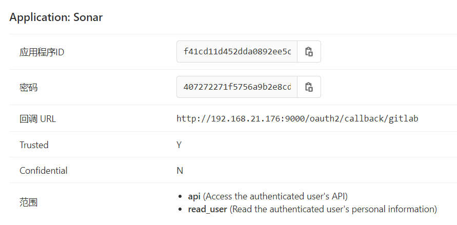

# 记一次sonar与gitlab集成的坑

`Sonar`（`SonarQube`）是一个开源平台，用于管理源代码的质量。`Sonar`不只是一个质量数据报告工具，更是代码质量管理平台。常见的语言都支持。

公司最近要做代码静态漏洞分析，调研了几款产品（`cobra`、`fortify`、`源伞科技`等）后，选择`SonarQube`暂时先用起来。后期可以考虑付费版本。

用`docker`安装了[`SonarQube`](https://hub.docker.com/_/sonarqube/)的最新版本（`8.6.0`），挺方便：
``` shell
docker pull sonarqube
docker run -d --name sonarqube -e SONAR_ES_BOOTSTRAP_CHECKS_DISABLE=true -p 9000:9000 sonarqube
```

本地用`http://localhost:9000`就可以看到操作界面，用户名和密码初始都是`admin`。

集成`gitlab`时遇到一些坑，在此记录一下。

## gitlab申请令牌

可以在`设置-应用`中操作，也可以在`管理中心-应用`中操作，效果是一样的。

具体步骤也可以看[官网](https://docs.sonarqube.org/latest/analysis/gitlab-integration/)。

新建一个应用，写入名称，随便写，一般是`SonarQube`，地址`http://192.168.21.176:9000/oauth2/callback/gitlab`，前面`ip`和端口部分，写你的`sonar`服务器的地址。最好用`https`，但不用也可以。

范围勾选`api`和`read_user`这两个。点提交后，可以看到以下页面：



上面的`应用程序ID`和密码，就要复制在下一步的`sonar`配置页面。

## sonar页面找到gitlab

在顶部菜单栏，找到`Administration`，打开左侧第一个`Configuration`，再`ALM Integrations`，可以看到`github`和`gitlab`集成。

我们在`gitlab`页面，主要做以下几项：

- 勾选`Enabled`
- 输入`GitLab URL`
- 填入上一步的`Application ID`和`Secret`
- 勾选`Allow users to sign-up`
- 勾选`Synchronize user groups`

我主要就被坑在`GitLab URL`这一步了，我是本地启动了一个`gitlab`服务，方便测试，先是没有启用`https`，`sonar`使用用户`gitlab`，报没有权限。

接着启用了`https`，但证书不对，又在网上找了个程序，生成一个本地测试的证书，仍是没有权限。

到`sonar`的日志文件里看错误信息：
```
web[AXbXAPJgc5Bvl4oAAAGv][o.s.s.a.AuthenticationError] Fail to callback authentication with 'gitlab'
java.lang.IllegalStateException: javax.net.ssl.SSLHandshakeException: PKIX path building failed: sun.security.provider.certpath.SunCertPathBuilderException: unable to find valid certification path to requested target
```

网上查，说还是证书问题，我进`sonar`容器内部，把证书导入，还是不行。

最后让同事看了下，他在公网环境搭建的没有问题，让我申请个正式的证书试试。于是，我又申请了个免费的证书，给了`gitlab`后，就可以了。

所以，这里`GitLab URL`一定要用`https`，而且证书一定要正式才行。

## 配置Server base URL

还是刚才的`Configuration`菜单下，找到`General`，再找到`Server base URL`，输入你的`sonar`服务器地址，我的是：`http://192.168.21.176:9000`。

如果没有这一步，默认会是`http://localhost:9000`。

## 登陆

回到登陆页，就可以看到以下页面，点击跳转登陆就可以了：

