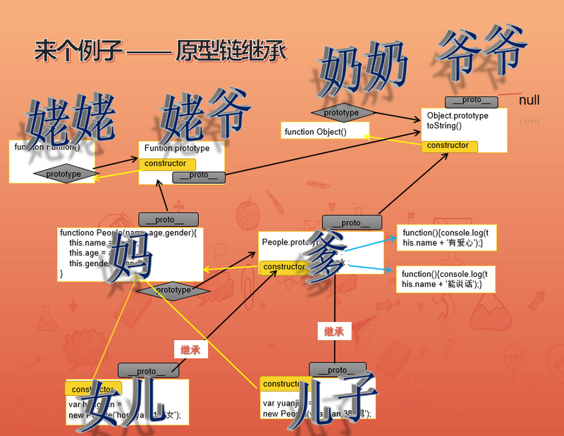

# 原型链继承

js的继承是原型链继承，其机制主要是利用`__proto__`，表面上是依赖于`prototype`。

## 继承图

)

构造函数（以`People`为例）可以分为2部分，一是函数本身（图中的`妈`），一是原型链`prototype`（图中的`爹`）。他们的实例（图中的儿女），继承了他们的基因。
标志这种继承关系的（类似世俗的族谱），是`__proto__`这个属性，它指向的是父亲（说明js也是父系社会）。而父亲当然也有父亲的标志，便是爷爷`Object.protoype`，爷爷祖上就是最牛逼的`null`，传说中的元始天尊，无中生有，诸果之因。
`妈`的母亲（`姥姥`）是`Function`，父亲（`姥爷`）是`Function.prototye`，爷爷也是`Object.protoype`。这么看这个家族确实比较混乱。

::: tip 简单结论
每一个孩子身上会有母亲内部的东西，有父亲、爷爷留下的传承。但跟姥姥、姥爷、奶奶没有关系。
:::

## 题目
``` js
var AA = function () {
    this.d  = 'dddd';
};
Object.prototype.a = 'aaaa';
Function.prototype.b = 'bbbb';
AA.prototype.c = 'cccc';
AA.e = 'eeee';

console.log(AA.a);//aaaa
console.log(AA.b); // bbbb
console.log(AA.c); // undefined
console.log(AA.d); // undefined
console.log(AA.e); // eeee

var aa = new AA();
console.log(aa.a); // aaaa
console.log(aa.b); // undefined
console.log(aa.c); // cccc
console.log(aa.d); // dddd
console.log(aa.e); // undefined

```

**分析**

AA是个函数。它相当于实例化了一个Function，所以`Function.prototype`上的属性会赋给AA，所以AA.b有值。
Function又继承自Object，所以`Object.prototype`上的属性也会给AA，所以AA.a有值。

aa是实例化了AA，它也继承Object，所以`Object.prototype`上的属性也会给aa，所以aa.a有值。但它不继承Function。

我们从上面的结论来看：

- `aa`是孩子，`AA`是妈，`AA.prototype`是爹，`Function.prototype`是姥爷，`Object.protoype`是爷爷。所以`aa`有`AA`有部分属性以及`AA.prototype`、`Object.protoype`的属性。

- `AA`则是找自己的父亲`Function.prototype`、爷爷`Object.protoype`。

## 常见的继承关系
``` js
aa.__proto__ === AA.prototype
AA.prototype.__proto__ === Object.prototype
Function.prototype.__proto__ === Object.prototype
Object.prototype.__proto__ === null
```

## hasOwnProperty与in的区别

`Object.prototype`上有一个方法`hasOwnProperty`，它只判断是否是属于自身的属性，不会去找原型身上的属性。

举个例子：
``` js
var Person = function(name){
    this.name = name;
};

Person.prototype.age = 13;

var p = new Person('haha');

console.log(Object.keys(p)); // ['name']
console.log(p.hasOwnProperty('age')); // false
console.log('age' in p); // true
console.log(p.age); // 13
```

所以，`Object.keys`的实现需要避过原型链查找才行：
``` js
Object.keys = function(obj){
    var arr = [];
    for(var key in obj){
        if(obj.hasOwnProperty(key)){
            arr.push(key);    
        }
    }
    return arr;
};
```


