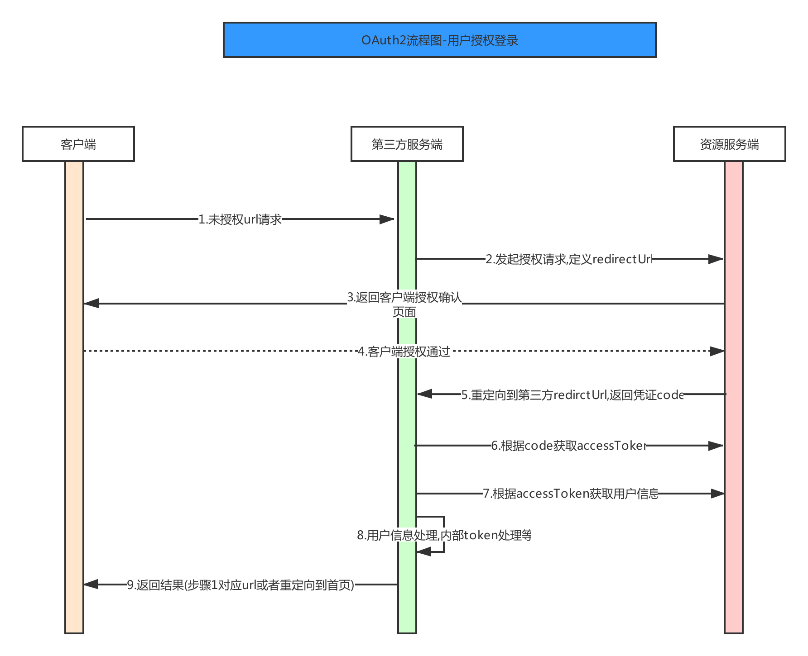

# oauth2

## 什么是OAuth2

`OAuth`（`Open Authorization`，开放授权）是为用户资源的授权定义了一个安全、开放及简单的标准，第三方无需知道用户的账号及密码，就可获取到用户的授权信息。

`OAuth2.0`是`OAuth`协议的延续版本，但不向后兼容`OAuth 1.0`，即完全废止了`OAuth1.0`。

`OAuth2`对比`OAuth1`，主要改变有下面几点：

1. 取消繁琐的签名，全部改用`HTTPS`。

2. `ATOK`（`access_token`）从原来的永久令牌变为临时令牌，增加`RefreshToken`

3. 取消获取`RequestToken`的步骤

4. 提供了多种场景的授权流程



## 步骤说明
以我们一个应用【小墙】为例，作为平台的子系统，账户需要使用`gitlab`的。

1. 用户访问小墙，小墙需要用户登录验证

2. 小墙发起`gitlab`授权请求
```
https://XX.com/oauth2/authorize?appid=APPID&redirect_uri=REDIRECT_URI&response_type=code&state=STATE
```
其中，`STATE`是一个随机的字符串，存储到`session`中，用来在回调api中校验是否来自`gitlab`授权后重定向的真实请求。这是为了防止[CSRF](./CSRF)（`Cross-site request forgery`，**跨站点请求伪造**）攻击。

3. 跳转到小墙服务器的`api`（上一步的`REDIRECT_URI`，例如`http://localhost:3000/api/login_callback?code=XXX`），`url`中`code`是上一步`gitlab`返回的参数。
根据它和相关信息，请求得到`access_token`。

```
https://XX.com/oauth/token?appid=APPID&secret=SECRET&code=XXX&grant_type=authorization_code
```
4. 根据`access_token`到`gitlab`获取用户信息
```
https://XX.com/oauth/userinfo?access_token=ACCESS_TOKEN
```
5. 将得到的用户信息与`access_token`一起加密，生成一个唯一的`token`值返回给前台，每次接口请求都携带这个`token`值，后台解密校验是否正确

``` js
const info = {
    userId: user.id,
    token: access_token,
    email: user.email,
    expires: expireTime(7) //默认7天过期
};
const token = encode(info);
```

解密使用`decode`。这两个方法， 一般使用非对称加密的方式：
``` js
const NodeRSA = require('node-rsa');
const fs = require('fs').promises;
let privatePem; // 私钥文件缓存
let publicPem; // 公钥文件缓存
const getPrivatePem = async function () {
  if (!privatePem) {
    privatePem = await fs.readFile('./config/pem/private.pem');
  }
  return privatePem;
};

const getPublicPem = async function () {
  if (!publicPem) {
    publicPem = await fs.readFile('./config/pem/public.pem');
  }
  return publicPem;
};

/**
 * 加密
 */
export const encode = async function (code: any): Promise<string> {
  const data = await getPrivatePem();
  const key = new NodeRSA(data);
  return key.encryptPrivate(code, 'base64');
};

/**
 * 解密
 */
export const decode = async function (code: string): Promise<any> {
  let result: any = false;
  try {
    const data = await getPublicPem();
    const key = new NodeRSA(data);
    result = key.decryptPublic(code, 'utf8'); //如果编译失败会报错
    return JSON.parse(result);
  } catch (e) {
    return result;
  }
};
```
   
参考：
- [Oauth2(1)简介](https://www.jianshu.com/p/6758afd262db)
- [OAuth2介绍与使用](https://www.jianshu.com/p/4f5fcddb4106)
- [OAuth2和1协议原理](https://weibo.com/p/23041815d69b2d00102wijy?sudaref=www.baidu.com&display=0&retcode=6102)
- [谈谈OAuth1,OAuth2异同](https://www.cnblogs.com/panchanggui/p/11588597.html)
- [Cross-Site Request Forgery](https://tools.ietf.org/html/draft-ietf-oauth-v2-26#section-10.12)